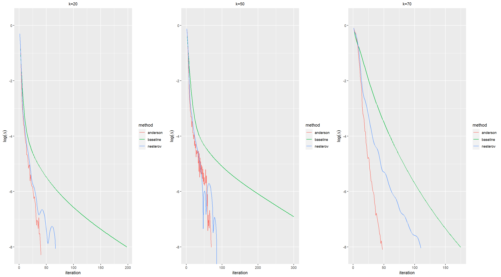

Simulation of General Data
================

Singular value decomposition ${\rm SVD}_k$:

``` r
SVD = function(k, X){
  svd_result <- svd(X)
  U <- svd_result$u
  d <- svd_result$d
  V <- svd_result$v
  d[-(1:k)] <- 0
  return(U %*% diag(d, length(d), length(d)) %*% t(V))
}
```

Soft-threshold operator ${\rm S}_{\lambda}$:

``` r
Soft_threshold = function(lambda, X){
  svd_result <- svd(X)
  U <- svd_result$u
  d <- svd_result$d
  V <- svd_result$v
  d <- (d - lambda)*((d - lambda) > 0)
  return(U %*% diag(d, length(d), length(d)) %*% t(V))
}
```

Loss function $l$:

``` r
loss = function(type, W, M, X, lambda = 0){
  #the value of type is "hard" or "soft", to clarify the penalty
  #if type is "hard" then lambda is not a valid parameter
  fnorm <- sum(W*(M - X)^2)
  if(type == "hard"){
    return(fnorm)
  }else if(type == "soft"){
    return(0.5*fnorm + lambda * sum( svd(X)$d ))
  }
}
```

Baseline Algorithm:

``` r
WLRMA = function(type, para, W, M, X_old = 0, ep = 1e-8, maxT = 300){ 
  #the value of type is "hard" or "soft", to clarify the penalty
  #if type is "hard" then para is k; otherwise, it is lambda
  
  if(X_old == 0){
    X_old <- matrix(0, nrow(M), ncol(M))
  }
  
  t <- 0
  val <- 0
  
  if(type == "hard"){
    k <- para
    loss_old <- loss("hard", W, M, X_old)
    repeat{
      t <- t+1
      X_new <- SVD(k, W*M + (1-W)*X_old)
      loss_new <- loss("hard", W, M, X_new)
      delta <- abs( ( loss_new - loss_old )/loss_old )
      val <- c(val, delta)
      val[1] <- t
      if(t >= maxT || delta < ep){
        break
      }
      X_old <- X_new
      loss_old <- loss_new
    }
  }else if(type == "soft"){
    lambda <- para
    loss_old <- loss("soft", W, M, X_old, lambda)
    repeat{
      t <- t+1
      X_new <- Soft_threshold(lambda, W*M + (1-W)*X_old)
      loss_new <- loss("soft", W, M, X_new, lambda)
      delta <- abs( ( loss_new - loss_old )/loss_old )
      val <- c(val, delta)
      val[1] <- t
      if(t >= maxT || delta < ep){
        break
      }
      X_old <- X_new
      loss_old <- loss_new
    }
  }
  
  return(val)
}
```

Nesterov Algorithm:

``` r
Nesterov = function(type, para, W, M, X_old = 0, V = 0, ep = 1e-8, maxT = 300){
  #the value of type is "hard" or "soft", to clarify the penalty
  #if type is "hard" then para is k; otherwise, it is lambda
  
  if(X_old == 0){
    X_old <- matrix(0, nrow(M), ncol(M))
  }
  
  if(V == 0){
    V <- matrix(0, nrow(M), ncol(M))
  }
  
  t <- 0
  val <- 0
  
  if(type == "hard"){
    k <- para
    loss_old <- loss("hard", W, M, X_old)
    repeat{
      t <- t+1
      X_new <- SVD(k, W*M + (1-W)*V)
      loss_new <- loss("hard", W, M, X_new)
      delta <- abs( ( loss_new - loss_old )/loss_old )
      val <- c(val, delta)
      val[1] <- t
      if(t >= maxT || delta < ep){
        break
      }
      V <- X_new + (t-1)/(t+2)*(X_new - X_old)
      X_old <- X_new
      loss_old <- loss_new
    }
  }else if(type == "soft"){
    lambda <- para
    loss_old <- loss("soft", W, M, X_old, lambda)
    repeat{
      t <- t+1
      X_new <- Soft_threshold(lambda, W*M + (1-W)*V)
      loss_new <- loss("soft", W, M, X_new, lambda)
      delta <- abs( ( loss_new - loss_old )/loss_old )
      val <- c(val, delta)
      val[1] <- t
      if(t >= maxT || delta < ep){
        break
      }
      V <- X_new + (t-1)/(t+2)*(X_new - X_old)
      X_old <- X_new
      loss_old <- loss_new
    }
  }
  
  return(val)
}
```

Anderson Algorithm:

``` r
Anderson = function(type, para, W, M, m = 3, Y_old = 0, ep = 1e-8, maxT = 300){
  #the value of type is "hard" or "soft", to clarify the penalty
  #if type is "hard" then para is k; otherwise, it is lambda
  
  if(Y_old == 0){
    Y_old <- matrix(0, nrow(M), ncol(M))
  }
  y_old <- c(Y_old)
  
  t <- 0
  val <- 0
  f <- numeric(0)
  r <- numeric(0)
  
  if(type == "hard"){
    k <- para
    X_old <- SVD(k, Y_old)
    loss_old <- loss("hard", W, M, X_old)
    repeat{
      t <- t+1
      f_old <- c(W*M + (1-W)*X_old)
      r_old <- f_old - y_old
      f <- cbind(f, f_old)
      r <- cbind(r, r_old)
      theta <- solve(t(r)%*%r) %*% rep(1,ncol(r))
      alpha_old <- 1/sum(theta)*theta
      y_old <- f %*% alpha_old
      Y_old <- matrix(y_old, nrow(M), ncol(M))
      X_new <- SVD(k, Y_old)
      loss_new <- loss("hard", W, M, X_new)
      delta <- abs( ( loss_new - loss_old )/loss_old )
      val <- c(val, delta)
      val[1] <- t
      if(t >= maxT || delta < ep){
        break
      }
      X_old <- X_new
      loss_old <- loss_new
      if(ncol(f) > m){
        f <- f[,-1]
        r <- r[,-1]
      }
    }
  }else if(type == "soft"){
    lambda <- para
    X_old <- Soft_threshold(lambda, Y_old)
    loss_old <- loss("soft", W, M, X_old, lambda)
    repeat{
      t <- t+1
      f_old <- c(W*M + (1-W)*X_old)
      r_old <- f_old - y_old
      f <- cbind(f, f_old)
      r <- cbind(r, r_old)
      theta <- solve(t(r)%*%r) %*% rep(1,ncol(r))
      alpha_old <- 1/sum(theta)*theta
      y_old <- f %*% alpha_old
      Y_old <- matrix(y_old, nrow(M), ncol(M))
      X_new <- Soft_threshold(lambda, Y_old)
      loss_new <- loss("soft", W, M, X_new, lambda)
      delta <- abs( ( loss_new - loss_old )/loss_old )
      val <- c(val, delta)
      val[1] <- t
      if(t >= maxT || delta < ep){
        break
      }
      X_old <- X_new
      loss_old <- loss_new
      if(ncol(f) > m){
        f <- f[,-1]
        r <- r[,-1]
      }
    }
  }
  
  return(val)
}
```

Regularization Anderson Algorithm:

``` r
Randerson = function(type, para, W, M, gamma = 0, m = 3, depth = 3, Y_old = 0, ep = 1e-8, maxT = 300){
  #the value of type is "hard" or "soft", to clarify the penalty
  #if type is "hard" then para is k; otherwise, it is lambda
  
  if(Y_old == 0){
    Y_old <- matrix(0, nrow(M), ncol(M))
  }
  y_old <- c(Y_old)
  
  t <- 0
  val <- 0
  f <- numeric(0)
  r <- numeric(0)
  alpha <- numeric(0)
  
  if(type == "hard"){
    k <- para
    X_old <- SVD(k, Y_old)
    loss_old <- loss("hard", W, M, X_old)
    repeat{
      t <- t+1
      f_old <- c(W*M + (1-W)*X_old)
      r_old <- f_old - y_old
      f <- cbind(f, f_old)
      r <- cbind(r, r_old)
      if(t <= m+1){
        theta <- solve(t(r)%*%r) %*% rep(1,ncol(r))
        alpha_old <- 1/sum(theta)*theta
        alpha <- rbind(alpha, c(rep(0, m+1-t), alpha_old))
      }else{
        f <- f[,-1]
        r <- r[,-1]
        k_min <- max(c(t-depth, m+1))
        alpha_ave <- apply(matrix(alpha[k_min:(t-1),], t-k_min, m+1), 2, mean)
        
        S <- solve(t(r)%*%r + gamma*diag(1,m+1,m+1))
        K <- S %*% (matrix(alpha_ave,m+1,1)%*%matrix(rep(1,m+1),1,m+1) - 
                      matrix(rep(1,m+1),m+1,1)%*%matrix(alpha_ave,1,m+1))
        alpha_star <- 1/sum(S%*%rep(1,m+1))*S%*%rep(1,m+1)
        alpha_old <- (diag(1,m+1,m+1) + gamma*K)%*%alpha_star
        alpha <- rbind(alpha, t(alpha_old))
      }
      y_old <- f %*% alpha_old
      Y_old <- matrix(y_old, nrow(M), ncol(M))
      X_new <- SVD(k, Y_old)
      loss_new <- loss("hard", W, M, X_new)
      delta <- abs( ( loss_new - loss_old )/loss_old )
      val <- c(val, delta)
      val[1] <- t
      if(t >= maxT || delta < ep){
        break
      }
      X_old <- X_new
      loss_old <- loss_new
    }
  }else if(type == "soft"){
    lambda <- para
    X_old <- Soft_threshold(lambda, Y_old)
    loss_old <- loss("soft", W, M, X_old, lambda)
    repeat{
      t <- t+1
      f_old <- c(W*M + (1-W)*X_old)
      r_old <- f_old - y_old
      f <- cbind(f, f_old)
      r <- cbind(r, r_old)
      if(t <= m+1){
        theta <- solve(t(r)%*%r) %*% rep(1,ncol(r))
        alpha_old <- 1/sum(theta)*theta
        alpha <- rbind(alpha, c(rep(0, m+1-t), alpha_old))
      }else{
        f <- f[,-1]
        r <- r[,-1]
        k_min <- max(c(t-depth, m+1))
        alpha_ave <- apply(matrix(alpha[k_min:(t-1),], t-k_min, m+1), 2, mean)
        
        S <- solve(t(r)%*%r + gamma*diag(1,m+1,m+1))
        K <- S %*% (matrix(alpha_ave,m+1,1)%*%matrix(rep(1,m+1),1,m+1) - 
                      matrix(rep(1,m+1),m+1,1)%*%matrix(alpha_ave,1,m+1))
        alpha_star <- 1/sum(S%*%rep(1,m+1))*S%*%rep(1,m+1)
        alpha_old <- (diag(1,m+1,m+1) + gamma*K)%*%alpha_star
        alpha <- rbind(alpha, t(alpha_old))
      }
      y_old <- f %*% alpha_old
      Y_old <- matrix(y_old, nrow(M), ncol(M))
      X_new <- Soft_threshold(lambda, Y_old)
      loss_new <- loss("soft", W, M, X_new, lambda)
      delta <- abs( ( loss_new - loss_old )/loss_old )
      val <- c(val, delta)
      val[1] <- t
      if(t >= maxT || delta < ep){
        break
      }
      X_old <- X_new
      loss_old <- loss_new
    }
  }
  
  return(list(ite = val[1], delta = val[-1], alpha = alpha))
}
```

Data Generation:

``` r
set.seed(1)
n = 1000
p = 100
r = 70
sigma = 1

A <- matrix(rnorm(n*r), n, r)
B <- matrix(rnorm(p*r), p, r)
err <- matrix(rnorm(n*p, 0, sigma^2), n, p)
W <- matrix(runif(n*p), n, p)
M <- A %*% t(B) + err
```

Simulation:

``` r
library(ggplot2)
library(gridExtra)
```

    ## Warning: 程辑包'gridExtra'是用R版本4.3.2 来建造的

``` r
library(ggeasy)
```

    ## Warning: 程辑包'ggeasy'是用R版本4.3.2 来建造的

``` r
library(tidyr)
```

    ## Warning: 程辑包'tidyr'是用R版本4.3.2 来建造的

``` r
#non_convex WLRMA

##k=20
k = 20

baseline <- WLRMA("hard", k, W, M) ###baseline
ite_base_1 <- baseline[1]
delta_base_1 <- log(baseline[-1], base = 10)
data_base_1 <- data.frame(cbind(1:ite_base_1, delta_base_1), "method" = "baseline")
colnames(data_base_1) = c("iteration", "delta", "method")

nesterov <- Nesterov("hard", k, W, M) ###nesterov
ite_nes_1 <- nesterov[1]
delta_nes_1 <- log(nesterov[-1], base = 10)
data_nes_1 <- data.frame(cbind(1:ite_nes_1, delta_nes_1), "method" = "nesterov")
colnames(data_nes_1) = c("iteration", "delta", "method")

anderson <- Anderson("hard", k, W, M) ###anderson
ite_and_1 <- anderson[1]
delta_and_1 <- log(anderson[-1], base = 10)
data_and_1 <- data.frame(cbind(1:ite_and_1, delta_and_1), "method" = "anderson")
colnames(data_and_1) = c("iteration", "delta", "method")

df1 <- rbind(rbind(data_base_1, data_nes_1), data_and_1)


##k=50
k = 50

baseline <- WLRMA("hard", k, W, M) ###baseline
ite_base_2 <- baseline[1]
delta_base_2 <- log(baseline[-1], base = 10)
data_base_2 <- data.frame(cbind(1:ite_base_2, delta_base_2), "method" = "baseline")
colnames(data_base_2) = c("iteration", "delta", "method")

nesterov <- Nesterov("hard", k, W, M) ###nesterov
ite_nes_2 <- nesterov[1]
delta_nes_2 <- log(nesterov[-1], base = 10)
data_nes_2 <- data.frame(cbind(1:ite_nes_2, delta_nes_2), "method" = "nesterov")
colnames(data_nes_2) = c("iteration", "delta", "method")

anderson <- Anderson("hard", k, W, M) ###anderson
ite_and_2 <- anderson[1]
delta_and_2 <- log(anderson[-1], base = 10)
data_and_2 <- data.frame(cbind(1:ite_and_2, delta_and_2), "method" = "anderson")
colnames(data_and_2) = c("iteration", "delta", "method")

df2 <- rbind(rbind(data_base_2, data_nes_2), data_and_2)


##k=70
k = 70

baseline <- WLRMA("hard", k, W, M) ###baseline
ite_base_3 <- baseline[1]
delta_base_3 <- log(baseline[-1], base = 10)
data_base_3 <- data.frame(cbind(1:ite_base_3, delta_base_3), "method" = "baseline")
colnames(data_base_3) = c("iteration", "delta", "method")

nesterov <- Nesterov("hard", k, W, M) ###nesterov
ite_nes_3 <- nesterov[1]
delta_nes_3 <- log(nesterov[-1], base = 10)
data_nes_3 <- data.frame(cbind(1:ite_nes_3, delta_nes_3), "method" = "nesterov")
colnames(data_nes_3) = c("iteration", "delta", "method")

anderson <- Anderson("hard", k, W, M) ###anderson
ite_and_3 <- anderson[1]
delta_and_3 <- log(anderson[-1], base = 10)
data_and_3 <- data.frame(cbind(1:ite_and_3, delta_and_3), "method" = "anderson")
colnames(data_and_3) = c("iteration", "delta", "method")

df3 <- rbind(rbind(data_base_3, data_nes_3), data_and_3)

a <- ggplot(df1, aes(iteration, delta, color = method)) +
         geom_line() + ylab(bquote(log(Delta)))+
         xlab("iteration")+
         labs(title="k=20")+
         coord_cartesian(ylim = c(-8.2, 0.2))+
         theme(plot.title = element_text(size=10, hjust=0.5))

b <- ggplot(df2, aes(iteration, delta, color = method)) +
         geom_line() + ylab(bquote(log(Delta)))+
         xlab("iteration")+
         labs(title="k=50")+
         coord_cartesian(ylim = c(-8.2, 0.2))+
         theme(plot.title = element_text(size=10, hjust=0.5))

c <- ggplot(df3, aes(iteration, delta, color = method)) +
         geom_line() + ylab(bquote(log(Delta)))+
         xlab("iteration")+
         labs(title="k=70")+
         coord_cartesian(ylim = c(-8.2, 0.2))+
         theme(plot.title = element_text(size=10, hjust=0.5))

grid.arrange(a,b,c,ncol=3)
```

<!-- -->

``` r
#WLRMA

##lambda=100
lambda=100

baseline <- WLRMA("soft", lambda, W, M) ###baseline
ite_base_1 <- baseline[1]
delta_base_1 <- log(baseline[-1], base = 10)
data_base_1 <- data.frame(cbind(1:ite_base_1, delta_base_1), "method" = "baseline")
colnames(data_base_1) = c("iteration", "delta", "method")

nesterov <- Nesterov("soft", lambda, W, M) ###nesterov
ite_nes_1 <- nesterov[1]
delta_nes_1 <- log(nesterov[-1], base = 10)
data_nes_1 <- data.frame(cbind(1:ite_nes_1, delta_nes_1), "method" = "nesterov")
colnames(data_nes_1) = c("iteration", "delta", "method")

anderson <- Anderson("soft", lambda, W, M) ###anderson
ite_and_1 <- anderson[1]
delta_and_1 <- log(anderson[-1], base = 10)
data_and_1 <- data.frame(cbind(1:ite_and_1, delta_and_1), "method" = "anderson")
colnames(data_and_1) = c("iteration", "delta", "method")

df1 <- rbind(rbind(data_base_1, data_nes_1), data_and_1)

##lambda=30
lambda=30

baseline <- WLRMA("soft", lambda, W, M) ###baseline
ite_base_2 <- baseline[1]
delta_base_2 <- log(baseline[-1], base = 10)
data_base_2 <- data.frame(cbind(1:ite_base_2, delta_base_2), "method" = "baseline")
colnames(data_base_2) = c("iteration", "delta", "method")

nesterov <- Nesterov("soft", lambda, W, M) ###nesterov
ite_nes_2 <- nesterov[1]
delta_nes_2 <- log(nesterov[-1], base = 10)
data_nes_2 <- data.frame(cbind(1:ite_nes_2, delta_nes_2), "method" = "nesterov")
colnames(data_nes_2) = c("iteration", "delta", "method")

anderson <- Anderson("soft", lambda, W, M) ###anderson
ite_and_2 <- anderson[1]
delta_and_2 <- log(anderson[-1], base = 10)
data_and_2 <- data.frame(cbind(1:ite_and_2, delta_and_2), "method" = "anderson")
colnames(data_and_2) = c("iteration", "delta", "method")

df2 <- rbind(rbind(data_base_2, data_nes_2), data_and_2)

##lambda=5
lambda=5

baseline <- WLRMA("soft", lambda, W, M) ###baseline
ite_base_3 <- baseline[1]
delta_base_3 <- log(baseline[-1], base = 10)
data_base_3 <- data.frame(cbind(1:ite_base_3, delta_base_3), "method" = "baseline")
colnames(data_base_3) = c("iteration", "delta", "method")

nesterov <- Nesterov("soft", lambda, W, M) ###nesterov
ite_nes_3 <- nesterov[1]
delta_nes_3 <- log(nesterov[-1], base = 10)
data_nes_3 <- data.frame(cbind(1:ite_nes_3, delta_nes_3), "method" = "nesterov")
colnames(data_nes_3) = c("iteration", "delta", "method")

anderson <- Anderson("soft", lambda, W, M) ###anderson
ite_and_3 <- anderson[1]
delta_and_3 <- log(anderson[-1], base = 10)
data_and_3 <- data.frame(cbind(1:ite_and_3, delta_and_3), "method" = "anderson")
colnames(data_and_3) = c("iteration", "delta", "method")

df3 <- rbind(rbind(data_base_3, data_nes_3), data_and_3)

a <- ggplot(df1, aes(iteration, delta, color = method)) +
         geom_line() + ylab(bquote(log(Delta)))+
         xlab("iteration")+
         labs(title=expression(paste(lambda, "=100")))+
         coord_cartesian(ylim = c(-8.2, -0.2))+
         theme(plot.title = element_text(size=10, hjust=0.5))

b <- ggplot(df2, aes(iteration, delta, color = method)) +
         geom_line() + ylab(bquote(log(Delta)))+
         xlab("iteration")+
         labs(title=expression(paste(lambda, "=30")))+
         coord_cartesian(ylim = c(-8.2, -0.2))+
         theme(plot.title = element_text(size=10, hjust=0.5))

c <- ggplot(df3, aes(iteration, delta, color = method)) +
         geom_line() + ylab(bquote(log(Delta)))+
         xlab("iteration")+
         labs(title=expression(paste(lambda, "=5")))+
         coord_cartesian(ylim = c(-8.2, -0.2))+
         theme(plot.title = element_text(size=10, hjust=0.5))

grid.arrange(a,b,c,ncol=3)
```

<!-- -->

``` r
#regularization anderson
k=50

randerson <- Randerson("hard", k, W, M, 0) ###gamma=0
ite_rand_1 <- randerson$ite
delta_rand_1 <- log(randerson$delta, base = 10)
alpha_rand_1 <- randerson$alpha
data_1 <- data.frame(cbind(1:ite_rand_1, delta_rand_1), "gamma" = "0")
colnames(data_1) = c("iteration", "delta", "gamma")
al1 <- data.frame(cbind(1:ite_rand_1, alpha_rand_1))
al1 <- al1 %>% pivot_longer(cols=c('V2', 'V3', 'V4', 'V5'),
       names_to='index',
       values_to='coefficient')

randerson <- Randerson("hard", k, W, M, 0.1) ###gamma=0.1
ite_rand_2 <- randerson$ite
delta_rand_2 <- log(randerson$delta, base = 10)
alpha_rand_2 <- randerson$alpha
data_2 <- data.frame(cbind(1:ite_rand_2, delta_rand_2), "gamma" = "0.1")
colnames(data_2) = c("iteration", "delta", "gamma")
al2 <- data.frame(cbind(1:ite_rand_2, alpha_rand_2))
al2 <- al2 %>% pivot_longer(cols=c('V2', 'V3', 'V4', 'V5'),
       names_to='index',
       values_to='coefficient')

randerson <- Randerson("hard", k, W, M, 1) ###gamma=1
ite_rand_3 <- randerson$ite
delta_rand_3 <- log(randerson$delta, base = 10)
alpha_rand_3 <- randerson$alpha
data_3 <- data.frame(cbind(1:ite_rand_3, delta_rand_3), "gamma" = "1")
colnames(data_3) = c("iteration", "delta", "gamma")
al3 <- data.frame(cbind(1:ite_rand_3, alpha_rand_3))
al3 <- al3 %>% pivot_longer(cols=c('V2', 'V3', 'V4', 'V5'),
       names_to='index',
       values_to='coefficient')

randerson <- Randerson("hard", k, W, M, 10) ###gamma=10
ite_rand_4 <- randerson$ite
delta_rand_4 <- log(randerson$delta, base = 10)
alpha_rand_4 <- randerson$alpha
data_4 <- data.frame(cbind(1:ite_rand_4, delta_rand_4), "gamma" = "10")
colnames(data_4) = c("iteration", "delta", "gamma")
al4 <- data.frame(cbind(1:ite_rand_4, alpha_rand_4))
al4 <- al4 %>% pivot_longer(cols=c('V2', 'V3', 'V4', 'V5'),
       names_to='index',
       values_to='coefficient')


a <- ggplot(al1, aes(x=V1, y=coefficient)) +
         geom_line(aes(color=index)) +
         labs(x = "iteration", y = "coefficient value", title = expression(paste(gamma, "=0"))) +
         coord_cartesian(xlim = c(-1,95), ylim = c(-13, 13))+
         theme(legend.position="none", plot.title = element_text(size=10, hjust=0.5))

b <- ggplot(al2, aes(x=V1, y=coefficient)) +
         geom_line(aes(color=index)) +
         labs(x = "iteration", y = "coefficient value", title = expression(paste(gamma, "=0.1"))) +
         coord_cartesian(xlim = c(-1,95), ylim = c(-13, 13))+
         theme(legend.position="none", plot.title = element_text(size=10, hjust=0.5))

c <- ggplot(al3, aes(x=V1, y=coefficient)) +
         geom_line(aes(color=index)) +
         labs(x = "iteration", y = "coefficient value", title = expression(paste(gamma, "=1"))) +
         coord_cartesian(xlim = c(-1,95), ylim = c(-13, 13))+
         theme(legend.position="none", plot.title = element_text(size=10, hjust=0.5))

d <- ggplot(al4, aes(x=V1, y=coefficient)) +
         geom_line(aes(color=index)) +
         labs(x = "iteration", y = "coefficient value", title = expression(paste(gamma, "=10"))) +
         coord_cartesian(xlim = c(-1,95), ylim = c(-13, 13))+
         theme(legend.position="none", plot.title = element_text(size=10, hjust=0.5))

grid.arrange(a,b,c,d,ncol=4)
```

<!-- -->

``` r
df <- rbind(rbind(rbind(data_1, data_2), data_3), data_4)

ggplot(df, aes(iteration, delta, color = gamma)) +
    geom_line() + ylab(bquote(log(Delta)))+
    xlab("iteration")+
    easy_add_legend_title(expression(gamma))
```

<!-- -->
