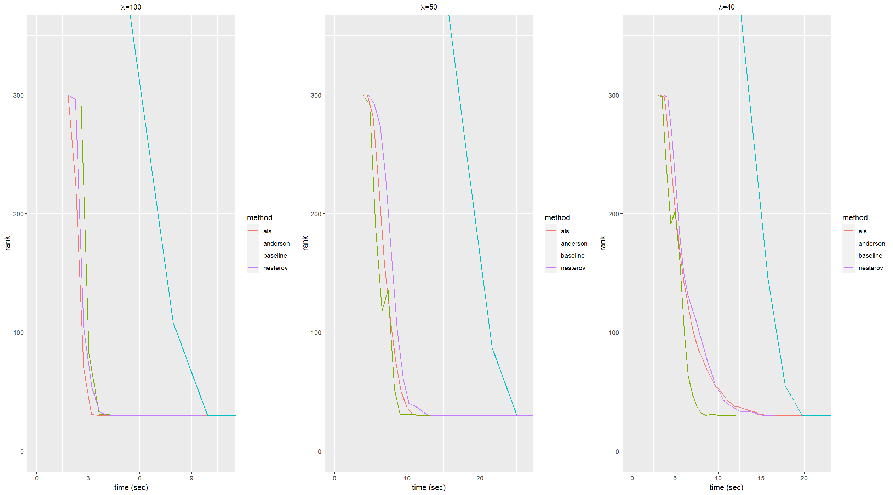
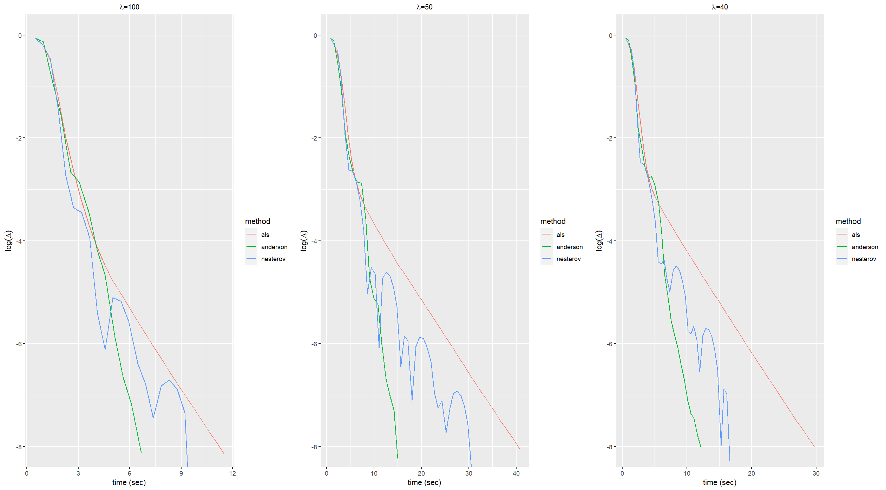

Simulation of High Dimensional Data
================

Loss function:

``` r
loss = function(W, M, X, lambda = 0){
  fnorm <- sum(W*(M - X)^2)
  return(0.5*fnorm + lambda * sum( svd(X)$d ))
}

loss_als = function(W, M, A, B, lambda = 0){
  fnorm <- sum(W*(M - A%*%t(B))^2)
  return(0.5*fnorm + 0.5*lambda * sum(A^2) + 0.5*lambda * sum(B^2))
}
```

Soft-threshold operator ${\rm S}_{\lambda}$:

``` r
Soft_threshold = function(lambda, X){
  svd_result <- svd(X)
  U <- svd_result$u
  d <- svd_result$d
  V <- svd_result$v
  d <- (d - lambda)*((d - lambda) > 0)
  return(U %*% diag(d, length(d), length(d)) %*% t(V))
}
```

Baseline Algorithm for WLRMA:

``` r
WLRMA = function(lambda = 0, W, M, X_old, ep = 1e-8, maxT = 300, maxtime = 600){ 
  
  time <- numeric(0)
  ite <- 0
  delta <- numeric(0)
  rank <- numeric(0)
  
  loss_old <- loss(W, M, X_old, lambda)
  repeat{
    ite <- ite+1
    
    tictoc::tic()
    X_new <- Soft_threshold(lambda, W*M + (1-W)*X_old)
    time_0 = tictoc::toc(quiet = TRUE)
    time <- c(time, time_0$toc - time_0$tic)
    
    loss_new <- loss(W, M, X_new, lambda)
    delta_0 <- abs( ( loss_new - loss_old )/loss_old )
    delta <- c(delta, delta_0)
    rank <- c(rank, qr(X_new)$rank)
    if(ite >= maxT || delta_0 < ep || sum(time)>=maxtime){
      break
    }
    X_old <- X_new
    loss_old <- loss_new
  }
  
  return(list(ite = ite, time = cumsum(time), delta = delta, rank = rank))
}
```

ALS Algorithm for WLRMA:

``` r
WLRMA_als = function(lambda = 0, W, M, A_old, B_old, ep = 1e-8, maxT = 300, maxtime = 600){ 
  
  time <- numeric(0)
  ite <- 0
  delta <- numeric(0)
  rank <- numeric(0)
  
  loss_old <- loss_als(W, M, A_old, B_old, lambda)
  repeat{
    ite <- ite+1
    
    tictoc::tic()
    X <- A_old%*%t(B_old)
    Y <- W*M + (1-W)*X
    B_new <- t(Y)%*%A_old%*%solve( t(A_old)%*%A_old + lambda*diag(1, ncol(A_old), ncol(A_old)) )
    X <- A_old%*%t(B_new)
    Y <- W*M + (1-W)*X
    A_new <- Y%*%B_new%*%solve( t(B_new)%*%B_new + lambda*diag(1, ncol(B_new), ncol(B_new)) )
    time_0 = tictoc::toc(quiet = TRUE)
    time <- c(time, time_0$toc - time_0$tic)
    
    loss_new <- loss_als(W, M, A_new, B_new, lambda)
    delta_0 <- abs( ( loss_new - loss_old )/loss_old )
    delta <- c(delta, delta_0)
    rank <- c(rank, qr(A_new%*%t(B_new))$rank)
    if(ite >= maxT || delta_0 < ep || sum(time)>=maxtime){
      break
    }
    A_old <- A_new
    B_old <- B_new
    loss_old <- loss_new
  }
  
  return(list(ite = ite, time = cumsum(time), delta = delta, rank = rank))
}
```

Nesterov Acceleration ALS Algorithm for WLRMA:

``` r
WLRMA_als_nesterov = function(lambda = 0, W, M, A_old, B_old, V_A, V_B, ep = 1e-8, maxT = 300, maxtime = 600){ 
  
  time <- numeric(0)
  ite <- 0
  delta <- numeric(0)
  rank <- numeric(0)
  
  loss_old <- loss_als(W, M, A_old, B_old, lambda)
  repeat{
    ite <- ite+1
    
    tictoc::tic()
    X <- V_A%*%t(V_B)
    Y <- W*M + (1-W)*X
    B_new <- t(Y)%*%V_A%*%solve( t(V_A)%*%V_A + lambda*diag(1, ncol(V_A), ncol(V_A)) )
    X <- V_A%*%t(B_new)
    Y <- W*M + (1-W)*X
    A_new <- Y%*%B_new%*%solve( t(B_new)%*%B_new + lambda*diag(1, ncol(B_new), ncol(B_new)) )
    time_0 = tictoc::toc(quiet = TRUE)
    time <- c(time, time_0$toc - time_0$tic)
    
    loss_new <- loss_als(W, M, A_new, B_new, lambda)
    delta_0 <- abs( ( loss_new - loss_old )/loss_old )
    delta <- c(delta, delta_0)
    rank <- c(rank, qr(A_new%*%t(B_new))$rank)
    if(ite >= maxT || delta_0 < ep || sum(time)>=maxtime){
      break
    }
    V_A <- A_new + (ite-1)/(ite+2)*(A_new - A_old)
    V_B <- B_new + (ite-1)/(ite+2)*(B_new - B_old)
    A_old <- A_new
    B_old <- B_new
    loss_old <- loss_new
  }
  
  return(list(ite = ite, time = cumsum(time), delta = delta, rank = rank))
}
```

Anderson Acceleration ALS Algorithm for WLRMA:

``` r
WLRMA_als_anderson = function(lambda = 0, W, M, A_old, B_old, m = 3, ep = 1e-8, maxT = 300, maxtime = 600){ 
  
  time <- numeric(0)
  ite <- 0
  delta <- numeric(0)
  rank <- numeric(0)
  F <- numeric(0)
  R <- numeric(0)
  
  loss_old <- loss_als(W, M, A_old, B_old, lambda)
  y <- c(rbind(A_old, B_old))
  repeat{
    ite <- ite+1
    
    tictoc::tic()
    X <- A_old%*%t(B_old)
    Y <- W*M + (1-W)*X
    B_new <- t(Y)%*%A_old%*%solve( t(A_old)%*%A_old + lambda*diag(1, ncol(A_old), ncol(A_old)) )
    X <- A_old%*%t(B_new)
    Y <- W*M + (1-W)*X
    A_new <- Y%*%B_new%*%solve( t(B_new)%*%B_new + lambda*diag(1, ncol(B_new), ncol(B_new)) )
    
    f <- c(rbind(A_new, B_new))
    r <- f - y
    F <- cbind(F, f)
    R <- cbind(R, r)
    theta <- solve(t(R)%*%R) %*% rep(1,ncol(R))
    alpha <- 1/sum(theta)*theta
    y <- F %*% alpha
    Z <- matrix(y, nrow(A_old) + nrow(B_old), ncol(A_old))
    A_new <- Z[1:nrow(A_old),]
    B_new <- Z[-(1:nrow(A_old)),]
    
    time_0 = tictoc::toc(quiet = TRUE)
    time <- c(time, time_0$toc - time_0$tic)
    
    loss_new <- loss_als(W, M, A_new, B_new, lambda)
    delta_0 <- abs( ( loss_new - loss_old )/loss_old )
    delta <- c(delta, delta_0)
    rank <- c(rank, qr(A_new%*%t(B_new))$rank)
    if(ite >= maxT || delta_0 < ep || sum(time)>=maxtime){
      break
    }
    A_old <- A_new
    B_old <- B_new
    loss_old <- loss_new
    if(ncol(F) > m){
      F <- F[,-1]
      R <- R[,-1]
    }
  }
  
  return(list(ite = ite, time = cumsum(time), delta = delta, rank = rank))
}
```

Data Generation:

``` r
set.seed(1)
n = 1000
p = 1000
r = 30
sigma = 1

A <- matrix(rnorm(n*r), n, r)
B <- matrix(rnorm(p*r), p, r)
err <- matrix(rnorm(n*p, 0, sigma^2), n, p)
W <- matrix(runif(n*p), n, p)
M <- A %*% t(B) + err
```

Simulation:

``` r
library(ggplot2)
library(gridExtra)
```

    ## Warning: 程辑包'gridExtra'是用R版本4.3.2 来建造的

``` r
# generate initial values
k = 300  
A_0 = matrix(rnorm(n * k), n, k)
B_0 = matrix(rnorm(p * k), p, k)
X_0 = A_0 %*% t(B_0)
V_A = matrix(rnorm(n * k), n, k)
V_B = matrix(rnorm(p * k), p, k)


##lambda = 100
lambda = 100

baseline <- WLRMA(lambda, W, M, X_0) ##baseline(PGD)
data_base <- data.frame(cbind(baseline$time, baseline$rank, baseline$delta), "method" = "baseline")

als <- WLRMA_als(lambda, W, M, A_0, B_0) ##als
data_als <- data.frame(cbind(als$time, als$rank, als$delta), "method" = "als")

nesterov <- WLRMA_als_nesterov(lambda, W, M, A_0, B_0, V_A, V_B) ##nesterov
data_nesterov <- data.frame(cbind(nesterov$time, nesterov$rank, nesterov$delta), "method" = "nesterov")

anderson <- WLRMA_als_anderson(lambda, W, M, A_0, B_0) ##anderson
data_anderson <- data.frame(cbind(anderson$time, anderson$rank, anderson$delta), "method" = "anderson")

df1 <- rbind(rbind(rbind(data_base, data_als), data_nesterov), data_anderson)
rownames(df1) = NULL
colnames(df1) = c("time", "rank", "delta", "method")


##lambda = 50
lambda = 50

baseline <- WLRMA(lambda, W, M, X_0) ##baseline(PGD)
data_base <- data.frame(cbind(baseline$time, baseline$rank, baseline$delta), "method" = "baseline")

als <- WLRMA_als(lambda, W, M, A_0, B_0) ##als
data_als <- data.frame(cbind(als$time, als$rank, als$delta), "method" = "als")

nesterov <- WLRMA_als_nesterov(lambda, W, M, A_0, B_0, V_A, V_B) ##nesterov
data_nesterov <- data.frame(cbind(nesterov$time, nesterov$rank, nesterov$delta), "method" = "nesterov")

anderson <- WLRMA_als_anderson(lambda, W, M, A_0, B_0) ##anderson
data_anderson <- data.frame(cbind(anderson$time, anderson$rank, anderson$delta), "method" = "anderson")

df2 <- rbind(rbind(rbind(data_base, data_als), data_nesterov), data_anderson)
rownames(df2) = NULL
colnames(df2) = c("time", "rank", "delta", "method")


##lambda = 40
lambda = 40

baseline <- WLRMA(lambda, W, M, X_0) ##baseline(PGD)
data_base <- data.frame(cbind(baseline$time, baseline$rank, baseline$delta), "method" = "baseline")

als <- WLRMA_als(lambda, W, M, A_0, B_0) ##als
data_als <- data.frame(cbind(als$time, als$rank, als$delta), "method" = "als")

nesterov <- WLRMA_als_nesterov(lambda, W, M, A_0, B_0, V_A, V_B) ##nesterov
data_nesterov <- data.frame(cbind(nesterov$time, nesterov$rank, nesterov$delta), "method" = "nesterov")

anderson <- WLRMA_als_anderson(lambda, W, M, A_0, B_0) ##anderson
data_anderson <- data.frame(cbind(anderson$time, anderson$rank, anderson$delta), "method" = "anderson")

df3 <- rbind(rbind(rbind(data_base, data_als), data_nesterov), data_anderson)
rownames(df3) = NULL
colnames(df3) = c("time", "rank", "delta", "method")


a_1 <- ggplot(df1, aes(time, rank, color = method)) +
           geom_line() + ylab("rank")+
           labs(title=expression(paste(lambda, "=100")))+
           coord_cartesian(xlim = c(0,11), ylim = c(0, 350))+
           xlab("time (sec)")+
           theme(plot.title = element_text(size=10, hjust=0.5))

b_1 <- ggplot(df2, aes(time, rank, color = method)) +
           geom_line() + ylab("rank")+
           labs(title=expression(paste(lambda, "=50")))+
           coord_cartesian(xlim = c(0,26), ylim = c(0, 350))+
           xlab("time (sec)")+
           theme(plot.title = element_text(size=10, hjust=0.5))

c_1 <- ggplot(df3, aes(time, rank, color = method)) +
           geom_line() + ylab("rank")+
           labs(title=expression(paste(lambda, "=40")))+
           coord_cartesian(xlim = c(0,22), ylim = c(0, 350))+
           xlab("time (sec)")+
           theme(plot.title = element_text(size=10, hjust=0.5))

grid.arrange(a_1,b_1,c_1,ncol=3)
```

<!-- -->

``` r
df_delta1 <- df1[df1$method != "baseline",]
a_2 <- ggplot(df_delta1, aes(time, log(delta, 10), color = method)) +
           geom_line() + ylab(bquote(log(Delta)))+
           labs(title=expression(paste(lambda, "=100")))+
           coord_cartesian(ylim = c(-8, 0))+
           xlab("time (sec)")+
           theme(plot.title = element_text(size=10, hjust=0.5))

df_delta2 <- df2[df2$method != "baseline",]
b_2 <- ggplot(df_delta2, aes(time, log(delta, 10), color = method)) +
           geom_line() + ylab(bquote(log(Delta)))+
           labs(title=expression(paste(lambda, "=50")))+
           coord_cartesian(ylim = c(-8, 0))+
           xlab("time (sec)")+
           theme(plot.title = element_text(size=10, hjust=0.5))

df_delta3 <- df3[df3$method != "baseline",]
c_2 <- ggplot(df_delta3, aes(time, log(delta, 10), color = method)) +
           geom_line() + ylab(bquote(log(Delta)))+
           labs(title=expression(paste(lambda, "=40")))+
           coord_cartesian(ylim = c(-8, 0))+
           xlab("time (sec)")+
           theme(plot.title = element_text(size=10, hjust=0.5))

grid.arrange(a_2,b_2,c_2,ncol=3)
```

<!-- -->
